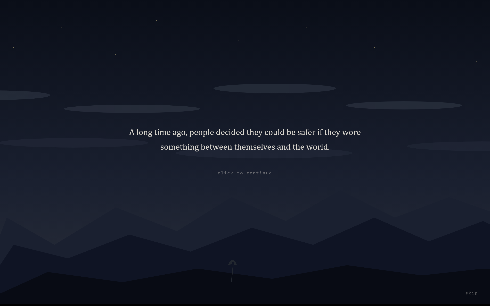
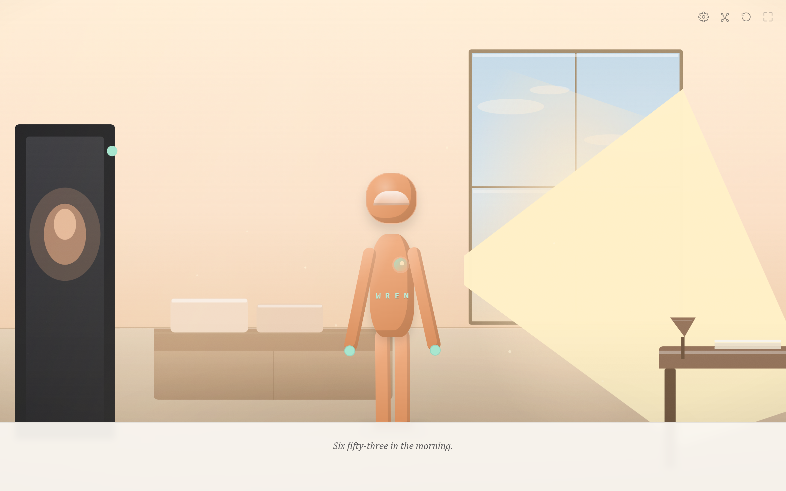
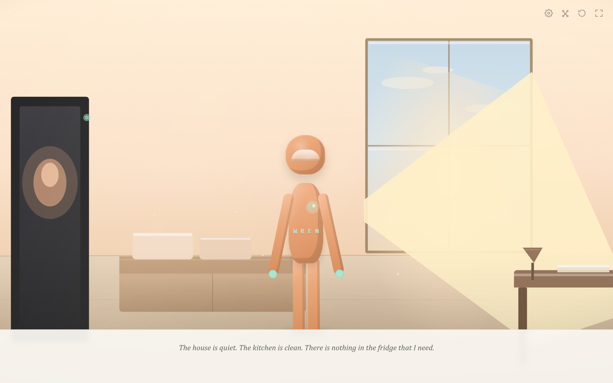

# The Air Outside

> *We build shells to be loved, and forget that we are inside them. The world doesn't need our performance. It only needs us to notice it.*

**The Air Outside** is a roughly one-hour web visual novel about mindfulness, presence, and the quiet appreciation of ordinary life. *(The title is a working title.)*

It's set in a middle/high school in a society where everyone moves through the world inside personalized exo-suits, decorated like phones, and treated as the main way people show status. The suits are a stand-in for the masks we put up and hide behind (I didn't want to tie it to any one thing). You play **Wren**, a default name you can change, someone who earnestly goes along with the crowd and slowly learns to step outside their suit. The hope here is small and personal, not some big change to society. One or two people might follow, at their own pace. The world does not transform, and that is the point.

The story tells itself through four recurring motifs (ants, a sticker, rain, and a hummed song) whose meanings shift as you go, and through a set of colors tied to each character. The climax hands you a single, quiet choice, and the only line in the whole game that speaks to you directly: *"Look up if you'd like."*

I made this game when I was going through a particularly mindful phase of my life. I don't practice mindfulness meditation much anymore, but I can always return to this game as a reminder of that chapter of my journey.

🌐 **Play it in your browser:** [the-air-outside.vercel.app](https://the-air-outside.vercel.app/)







## Status

Playable end to end. All **15 scenes**, **4 branching gates**, and **9 distinct endings** are in, with 100+ hand-coded SVG illustrations and procedural ambient audio. It runs in the browser and as a native Windows desktop app.

Still open: audio is parsed but not yet wired to playback, a couple of endings share artwork, and cross-platform desktop/mobile (MAUI) isn't scaffolded. See [CLAUDE.md](CLAUDE.md) for the full phase log and open decisions.

## Features

- **15 scenes, 4 gates, 9 endings.** Your choices at four points fan out into nine different endings, each with its own title, writing, and art.
- **A pause mechanic at the climax.** The UI dissolves and the game asks you, once and only once, to look up.
- **Hand-illustrated, code-first art.** Every background, character, and motif is hand-coded SVG. No raster assets, no AI-generated art (see [Art & audio philosophy](#art--audio-philosophy) below).
- **Procedural ambient audio.** Music is synthesized at runtime from oscillators tuned to seven moods that crossfade with the scene. No audio files shipped.
- **Customizable protagonist name,** persisted across sessions.
- **Reader-friendly UX.** Manual or auto-advance, adjustable text size and fade, light/dark themes, reduce-motion, a scene picker, a full story map, and a backlog of every line read.
- **Fullscreen mode.** Toggle it in the top bar, or press `F` / `F11`.

## Controls

| Action | Input |
|---|---|
| Advance | Click, `Space`, `Enter`, `→`, `↓` |
| Go back | `←`, `↑` |
| Menu | `Esc` |
| Fullscreen | `F`, `F11`, or the top-bar icon |
| Parallax "look" | Move the mouse, or `W` `A` `S` `D` |

## Tech stack

| Layer | Choice |
|---|---|
| Narrative script | **[Ink](https://www.inklestudios.com/ink/)**, Inkle's branching-narrative DSL, authored as plain `.ink` files |
| Ink runtime / compiler | **Qyl27.Ink.Engine** / **Qyl27.Ink.Compiler** (community .NET ports) |
| App framework | **Blazor WebAssembly** on **.NET 10** (C# end to end) |
| Desktop host | **WPF + `BlazorWebView`** (`Microsoft.AspNetCore.Components.WebView.Wpf`), Windows |
| Audio | Procedural **Web Audio** synth (no files) |
| Save / settings | Browser `localStorage` via JS interop |
| Art | Hand-coded **SVG** components |
| Hosting | Static publish to **Vercel** (or any static host) |

The renderer is intentionally decoupled from the script. Writers can work entirely in `ink/` without touching C#, and the Blazor renderer could be swapped out.

## Getting started

**Prerequisites:** the [.NET 10 SDK](https://dotnet.microsoft.com/download). For the desktop app, you'll want Windows with the Evergreen WebView2 Runtime (preinstalled on Windows 10/11).

### Run in the browser

```powershell
dotnet run --project src/VisualNovel.Web
# then open http://localhost:5156
```

### Run as a desktop app (Windows)

```powershell
dotnet run --project src/VisualNovel.Desktop
```

This renders the same components natively in a window. No localhost server, no WebAssembly download.

### Edit the story

Scene scripts live in `ink/`. After editing them, recompile to `story.json`:

```powershell
dotnet run --project src/VisualNovel.InkBuild
```

> The desktop app reads a copy of `story.json` baked in at build time, so re-run `InkBuild` **before** building or running Desktop after editing scenes. The web app picks up the new `story.json` on its next build.

## Building & publishing

**Web (static folder):**

```powershell
dotnet publish src/VisualNovel.Web -c Release -o publish
# publish/wwwroot/ is the static shipping folder
```

**Desktop (downloadable, self-contained Windows build):**

```powershell
dotnet publish src/VisualNovel.Desktop -c Release -r win-x64 --self-contained true -p:PublishSingleFile=true -o publish-desktop
```

This produces `publish-desktop/The Air Outside.exe`, which bundles the .NET runtime so the player needs no install beyond the preinstalled WebView2 runtime. Distribute the **whole `publish-desktop` folder** (the exe needs its sibling files). The build is unsigned, so Windows SmartScreen shows a *"More info → Run anyway"* prompt on first launch.

## Deployment

The repo includes [vercel.json](vercel.json) and [build.sh](build.sh). Connect the GitHub repo in Vercel and it runs `build.sh` (installs .NET 10, compiles Ink to `story.json`, publishes the Blazor WASM app) and serves `publish/wwwroot`. The live site tracks the repo, so every push to `main` triggers a rebuild. (The desktop app does not auto-update; it's an offline snapshot from the moment it was published.)

## Project structure

```
ink/                       Narrative scripts (.ink) → compiled to story.json
src/
  VisualNovel.Shared/      Razor Class Library: components, services, SVG art, CSS, story.json
  VisualNovel.Web/         Blazor WebAssembly entry point (thin shell over Shared)
  VisualNovel.Desktop/     WPF + BlazorWebView desktop host, Windows (thin shell over Shared)
  VisualNovel.InkBuild/    Console tool: compiles ink/story.ink → Shared/wwwroot/story.json
scripts/                   Authoring helpers (e.g. third-person → first-person conversion)
*.md                       Design docs (see below)
```

### Branching

Four gate choices drive the branches; the last two (`gate3` × `gate4`) produce the nine endings.

| Gate | Scene | Options |
|---|---|---|
| `gate1` | 4, The Lesser Suits | silent / speak / deflect |
| `gate2` | 5, The Window | approach / avoid |
| `gate3` | 12, The Door | iris / stay / tae |
| `gate4` | 14, Bare | stay_out / suit_no_deco / re_enter |

## Design documents

These are the creative source of truth. Read them before contributing to the story:

1. [story-bible.md](story-bible.md): thesis, themes, tone, the four motifs and their meaning arcs, per-character palettes, and the things the story refuses to do
2. [characters.md](characters.md): the six characters, surface vs. interior, and the suit-as-mask reading
3. [outline.md](outline.md): 15 scenes, 4 gates, the branch map, and the 9 ending combinations
4. [mechanics.md](mechanics.md): the climax pause mechanic and the everyday slow pacing that earns it
5. [art-plan.md](art-plan.md): the placeholder-first build order and the hand-illustrated flat-graphic style

[CLAUDE.md](CLAUDE.md) documents the architecture, conventions, phase history, and build gotchas.

## Art & audio philosophy

This is a story about masks, so it refuses to wear one. **AI-generated art is not an acceptable final asset.** It may be used for ideation or reference only, and disclosed if so. All current artwork is hand-coded SVG. Music is generated procedurally at runtime rather than shipped as files. The aim throughout is to grant dignity to ordinary, unnoticed things, and to build *this* story, with its specific taste and philosophy, rather than a more marketable version of it.

## License

This is a personal art project. The source is public for transparency and curiosity, but the story, characters, artwork, and music are **not** licensed for reuse or redistribution. All rights reserved by the author. If you'd like to use any part of it, please ask first.


<!-- cvs-repo: CVS hub (Alexander) repo metadata. Edit the values; keep the fence. -->
```cvs-repo
slug: visualnovel
name: The Air Outside
description: Personal art-project visual novel — Blazor WASM + Ink, 15 scenes, 9 endings
aliases: []
owners: [wchenyinmethod]
areas:
  STORY: Story engine — StoryService, Ink runtime, timeline, tags, state machine
  SAVE: Persistence — SaveService, SettingsService, localStorage keys and schema
  SETTINGS: User settings — defaults, ranges, reset, auto-advance, theme, audio volumes
  UI: UI shell — Stage, TopBar, panels, scene picker, fullscreen, responsive breakpoints
  CLIMAX: Climax pause mechanic — fade, dwell, auto-advance suppression, fourth-wall constraint
  AUDIO: Audio system — MusicService, procedural synth, mood-per-scene, no-files constraint
  NARR: Narrative content — scenes, gates, endings, first-person, em-dash, pacing tags
  BUILD: Build pipeline — InkBuild, WASM publish, Vercel deploy, zero-JS-deps constraint
  ART: Visual rendering — Background, Character, Motif, SpotArt SVG components
```
