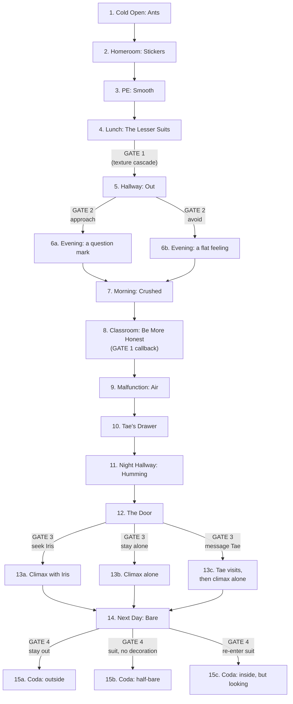

# Outline

A ~1-hour playthrough in 15 scenes. Branching philosophy: **many small choices that change texture, a few major choices (Gates) that change which scene plays**.

Approximate per-scene times shown. The story's spine does not change across branches; what changes is *which version of a moment* the player sees, and the accumulated tone of the climax and coda.

Legend:
- `S` = small/texture choice (changes a line or two of dialogue, never a scene)
- `GATE` = major branch point (changes which variant of a scene plays)
- All branches converge at scene 14, which itself has a final gate determining the coda variant

---

## Scene 1 — Cold Open: "Ants" *(~3 min)*

Wren's suit boots up. The corporate ambient tune plays; under it, Wren hums one faint bar of a different song (**Motif 4, first appearance — quiet enough that some players will miss it**). Walking to school, the suit-cam zooms casually on an ant hill being built on a curb (**Motif 1, first appearance**). Wren watches a beat longer than necessary. Tae pings. Wren composes their voice and answers.

Establishes: world, suit interface, Wren's voice-modulator, Wren's quiet curiosity, the two opening motifs.

**No branches.** The story starts everyone in the same place.

---

## Scene 2 — Homeroom: "Stickers" *(~4 min)*

Tae presents this morning's decoration suggestion. Wren applies the sticker (**Motif 2, first appearance**). Background: Cael is loud, holding court. The janitor passes the doorway, humming faintly (**Motif 4, foreshadow** — most players won't notice).

- `S`: Wren picks Tae's suggested sticker / suggests a slight variation / declines politely (Tae picks a backup for them either way). Texture only.

---

## Scene 3 — PE / Dexterity: "Smooth" *(~5 min)*

Mr. Ozaki teaches a dexterity drill. He briefly steps out of his suit to demonstrate a movement, then steps back in. The class falls silent. He says: "It's faster to show you." (**Ozaki's small revealing moment 1.**) Through a window, Iris is visible outside, not in PE uniform, walking somewhere. Rain begins, audible as muffled white noise inside the suit (**Motif 3, first appearance**).

- `S`: Wren practices diligently / asks Ozaki a question / lets their attention drift to the window (Iris). Texture only — but the "drift" option subtly primes scene 5.

---

## Scene 4 — Lunch: "The Lesser Suits" *(~4 min)*

In the cafeteria, Cael loudly mocks a kid whose suit has only one sticker. The friend group laughs uneasily. Tae laughs along while glancing at Wren.

- `GATE 1`: Wren stays silent / quietly says something / changes the subject.
  - This gates a small variant in scene 8 (whether the mocked student speaks to Wren after class), but does **not** fork the main plot.

---

## Scene 5 — Hallway: "Out" *(~3 min)*

Between classes, Wren rounds a corner. Iris is there, fully outside her suit, just standing at a window watching rain (**Motif 3, reappearance 1**). Iris turns and notices Wren noticing her. She does not say anything. The silence is offered, not demanded.

- `GATE 2 (major)`: Wren approaches / pretends not to see / turns away.
  - **Approach** path: short exchange. Iris does not explain. Wren asks nothing. Wren walks away unmoored but does not report her.
  - **Pretend / turn away** path: Wren walks past, vitals normal, but something has lodged.

This gate determines the emotional texture of scene 6 and shifts a few lines in scenes 8 and 12.

---

## Scene 6 — Evening: "Charging" *(~5 min)*

Variant by Gate 2:
- **(approach)**: Wren is at home, suit charging. There is a brief, contentless message from Iris — just a question mark, nothing more. Wren does not reply. They sit at their desk for a full minute doing nothing. A fragment of the hummed song surfaces in memory (**Motif 4, reappearance — Wren remembers their grandmother**).
- **(avoid)**: Wren is at home, suit charging. No message. The same minute of doing nothing — but with a different weight. The memory of the song surfaces anyway, but Wren shuts it down faster.

- `S`: Wren leaves the day's decorations on / takes them off / replaces them with something subtly different. Texture only, but feeds into scene 7's framing.

---

## Scene 7 — Next Morning: "Crushed" *(~3 min)*

Walking back to school. The ant hill from scene 1 is now partially crushed under a tread mark. Some ants are rebuilding (**Motif 1, reappearance 1 — meaning shifts from *wonder* to *obedience after damage***).

- `S`: Wren stops / hurries past / lingers for a beat. Texture only.

---

## Scene 8 — Classroom: "Be More Honest" *(~5 min)*

Mr. Ozaki is subbing for a sick literature teacher. He reads a short prose passage — a passage with the cadence of the 1984 prole-woman moment, about noticing an ordinary stranger at her work. The classroom discusses it.

Variants by Gate 1 callback:
- **(Wren spoke up at lunch)**: The mocked student from scene 4 quietly thanks Wren after class. Single line, no fuss.
- **(Wren stayed silent)**: No one talks to Wren after class. Wren walks out alone and registers, for the first time, that no one has spoken to them today.
- **(Wren changed the subject)**: A muted middle — one classmate nods at Wren in passing. No words.

- `S`: Wren contributes to the literature discussion / stays silent / writes a private note in their suit's text buffer. Texture only.

**Ozaki's small revealing moment 2**: a student left a worksheet on his desk. Visible in passing — a poem about suits with his pencil note: *be more honest*. The player may or may not catch this.

---

## Scene 9 — Malfunction: "Air" *(~4 min)*

Mid-day. Wren is alone in a corridor between classes. Their suit briefly malfunctions — the chest seal cracks open for two seconds and air touches their collarbone before the suit reseals. Wren is flooded with sensation and panic, instinctively suppresses the memory, reports to the nurse, gets a replacement seal. They are told it is nothing to worry about.

**No branch.** This is the story owning a beat — the body remembering before the mind is ready.

---

## Scene 10 — After School: "Tae's Drawer" *(~5 min)*

Tae invites Wren over. While Tae is in another room briefly, Wren glimpses the drawer where Tae keeps the old un-applied sticker from last year (**Tae's small revealing moment**). Tae returns and confides something — small, not a tragedy: she is afraid she is becoming forgettable.

(**Motif 2, reappearance 1** — the sticker recontextualized by Tae's drawer rather than by Wren's shoulder. The audience learns it has weight for *other* people too.)

- `S`: Wren is supportive / honest about their own drift / changes the subject. Texture only — but the "honest" option costs Tae something visible.

---

## Scene 11 — Night Hallway: "Humming" *(~3 min)*

Wren is staying late for a school errand. The janitor is working an empty hallway, humming the song (**Motif 4, reappearance — Wren hears it clearly for the first time**). Iris is also present, outside her suit, listening. The two never speak. They have an arrangement.

- `S`: Wren approaches Iris / approaches the janitor / leaves without speaking to either. Texture only.

This is the motifs converging scene — sticker (off, on Tae's drawer), song (heard clearly), the *seeing* of the janitor for the first time as a complete person.

---

## Scene 12 — Choice: "The Door" *(~3 min)*

Wren is alone, suit charging. A long pause. They could go find Iris. They could not.

- `GATE 3 (major)`: seek Iris / stay / message Tae instead.
  - **Seek Iris**: routes to scene 13a (climax *with Iris present, as witness*).
  - **Stay**: routes to scene 13b (climax *alone, solitary*).
  - **Message Tae**: Tae visits. Wren almost confides but does not. The scene ends in a quiet held silence. After Tae leaves, scene 13b plays — Wren steps outside alone, slightly more weighted with what was almost said.

---

## Scene 13 — Step Outside: Climax *(~6-8 min, including the pause mechanic)*

The form of this scene depends on Gate 3. See [mechanics.md](mechanics.md) for the pause-mechanic design.

### 13a — With Iris

Wren goes to where Iris waits — a place Iris uses for this. They sit. Iris does not narrate. Wren removes the suit. The pause mechanic engages.

Wren feels the air (**Motif 3, reappearance 2 — rain felt on bare skin, the screen nearly silent**). Wren cries or does not. After the pause:
- Iris tells Wren what made her step out. **One sentence. No more.**

### 13b — Alone

Wren is in their bedroom. They remove the suit themselves. The pause mechanic engages.

Wren hums the song softly (**Motif 4, reappearance — Wren hums it aloud for the first time**). They cry or do not.

### 13c — After Tae

As 13b, but preceded by the Tae visit. The hum has more weight; the silence after Tae leaves is the loudest thing in the scene.

---

## Scene 14 — Next Day: "Bare" *(~5 min)*

Wren returns to school. The corridors look the same.

- `GATE 4 (final, major)`: how Wren shows up today.
  - **Stay out** — fully without suit
  - **Suit, no decoration** — wearing the suit but unadorned, like Iris and Ozaki
  - **Re-enter the suit (with a difference)** — fully suited and decorated, but their gaze is different

Texture in scene 14:
- Tae's reaction varies — but in all branches she does *not* report Wren and does *not* look away
- Ozaki gives a single nod, no words
- Cael says nothing — he doesn't have a script for this
- The mocked student from scene 4 makes eye contact (longer in some variants)

---

## Scene 15 — Coda: "Watching" *(~4 min)*

The ant hill again (**Motif 1, reappearance 2 — recontextualized once more**). Wren watches at eye level (if outside the suit) or via the suit-cam zoom (if inside). Final image in all branches: a single ant carrying something three times its size.

### 15a — Coda for "Stay out"

Iris and Wren together, briefly. Tae passes; she does not look away. A look held. The janitor passes the curb on her way home from work — and she is the only saturated thing in the wide shot (**Motif 6 / pink-bear payoff — color theory borrowed from BB**). A small handful of other shoulders are bare in the background — change is local and small. The hum surfaces, carried by more than one voice.

### 15b — Coda for "Suit, no decoration"

Wren walks into school. Their bare shoulder. A small handful of other shoulders are also bare. Tae's drawer might be empty. Or not. The sticker (**Motif 2, final state**) is in Wren's bedside drawer, on the windowpane.

### 15c — Coda for "Re-enter the suit"

The ant hill is observed from inside the suit, but Wren has zoomed in deliberately — they are now the one *choosing* to look. The world is still mediated, but they are looking. The hope is quieter. The hum is internal — the player hears it on the audio track, but Wren has not hummed it aloud. The story's promise: one day they will step out again. The change is interior and real. *No ending is correct. The story commits to that.*

---

## Branch map

## Time budget

| Scene | Minutes |
|---|---|
| 1. Cold Open | 3 |
| 2. Homeroom | 4 |
| 3. PE | 5 |
| 4. Lunch | 4 |
| 5. Hallway | 3 |
| 6. Evening | 5 |
| 7. Morning | 3 |
| 8. Classroom | 5 |
| 9. Malfunction | 4 |
| 10. Tae's Drawer | 5 |
| 11. Night Hallway | 3 |
| 12. The Door | 3 |
| 13. Step Outside | 7 |
| 14. Next Day | 5 |
| 15. Coda | 4 |
| **Total** | **63 min** |

Built with ~3 minutes of slack — the climax pause is the most variable element, so playtest timing there will be the swing.

## Variant scene count

- 4 small texture choices per playthrough × ~12 scenes with texture options → manageable per-playthrough variation
- 4 gates, but only 3 produce truly distinct *scene content* (Gate 1 is a texture cascade)
- 9 distinct climax-and-coda combinations (3 climax × 3 coda)

Replay incentive: Gates 3 and 4 together produce nine endings; the rain motif, the hum, and the janitor nod accrue differently across them. Two or three playthroughs are rewarding without becoming a completionist treadmill.
